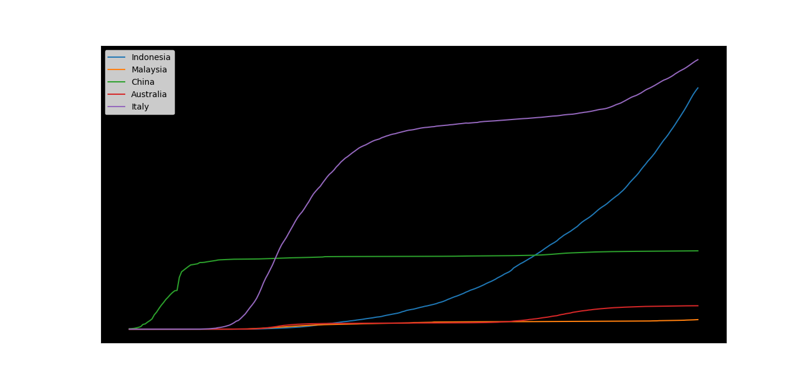
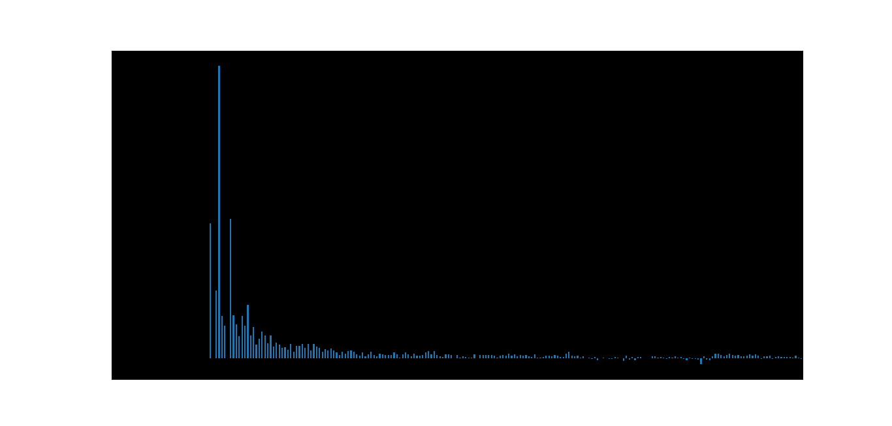

Analisis Covid-19 Python
=====

The data we take from the datasets of the Humanitarian, because they package the data carefully, accurately and up to date, and the data they present is in the form of CSV.

Datasets --> https://data.humdata.org/dataset/novel-coronavirus-2019-ncov-cases

To shorten and simplify the work, we are using two great python libraries namely `Pandas <https://pandas.pydata.org/>`__ and `Matplotlib <https://matplotlib.org/>`__.

Visualisation Preview
-------------

Simulation Preview
-------------

